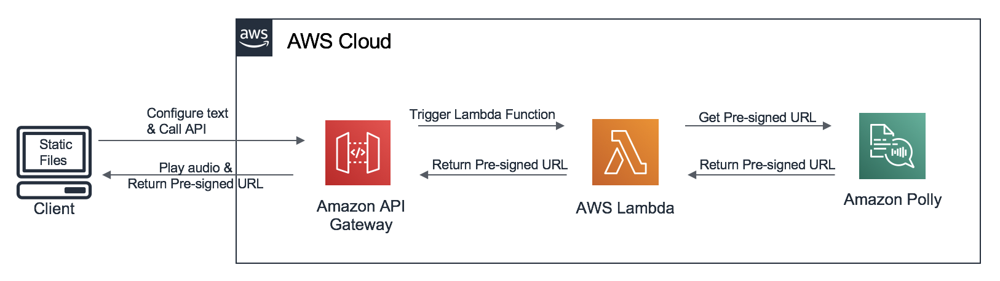
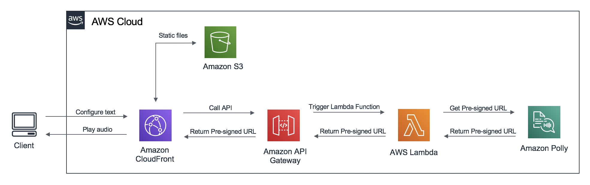

### Why am I here?

 Welcome to the Amazon Polly Builder Demo. As you may or may not know, you can use Amazon Polly to generate speech from either plain text or from documents marked up with Speech Synthesis Markup Language (SSML). The objective of this demo is for you to try out the different SSML tags available in a user friendly way and easily enable you to create enriched speech fragments.

### Why do I need?

1. **Web Browser** I imagine you already have one if you are reading this.  
2. **AWS Account** If you don't already have an account or you have not been handed one as part of a workshop, please visit the following link! 
3. **Text editor** Don't worry if you are not a Coding Guru, I promise setting the demo up will be very easy!

### What am I going to build?

As mentioned before, the objective is for you to test the different SSML tags you can use with Amazon Polly, so for this reason you are going to deploy all the infrastructure needed automatically with an AWS CloudFormation template already created. 

Let's have a look at the two infrastructures you are going to be able to deploy. 

#### 1. I want to run the webapp locally on my computer!

If you choose to deploy this semi-automated infrastructure, Amazon API Gateway and AWS Lambda (with the appropriate role to call Amazon Polly) will be deployed and configured. You will also have to open the static assets locally on your computer and make a small change in the code which I will specify you later.

* **Step 1:** Deploy the AWS Infrastructure:
  * Launch() the following AWS CloudFormation Template in your account (The link will automatically open the AWS CloudFormation console).
  * All parameters are already configured so just check the I acknowledge that AWS CloudFormation might create IAM resources box and click Create stack.
  * Wait until the stack goes into the CREATE_COMPLETE status, then go to the Outputs tab.
  * You will see an output named ApiEndpoint. Take note of the url, as you will use it later. 

* **Step 2:** Download the necessary static files to run the webapp and configure the API call.
    * Download the following .zip file and decompress it! 
    * Open the **script.js** located in the **js** folder and insert the API url from the previous step in the first line, where you will see the follwing code:
    
    ``HERE COMES THE CODE`` 
    
* **Step 3:** You are now ready to open the index.html file and start testing some of the different SSML tags available in Amazon Polly.

#### 2. I want Amazon Cloudfront and S3 to deliver the webapp!

If you choose to deploy the fully-automated infrastructure, in addition to the services mentioned in the previous point, an Amazon Cloudfront Distribution will also be deployed to securely access the statics assets that will be stored in an Amazon S3 bucket. 

* **Step 1:** Deploy the AWS Infrastructure:
  * Launch() the following AWS CloudFormation Template in your account (The link will automatically open the AWS CloudFormation console).
  * All parameters are already configured so just check the I acknowledge that AWS CloudFormation might create IAM resources box and click Create stack.
  * Wait until the stack goes into the CREATE_COMPLETE status, then go to the Outputs tab.
  * You will see an output named CloudFront Endpoint.

* **Step 2:** You are now ready to open the Amazon CloudFront Endpoint and start testing some of the different SSML tags available in Amazon Polly.

### This looks really cool, but what is going on underneath?
